# Dev Story 

dev-story is a blogger website. here user can write their own story, other story like comment,
In This Project build I use Nodejs, React and Mongodb, Redis as a caching storage

### This Application under development

Live Link https://story-sharing.netlify.app

### Preview screenshot

####  Homepage
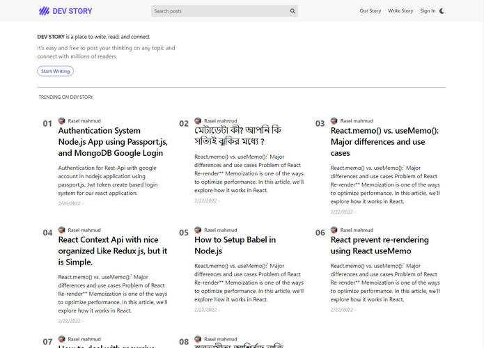
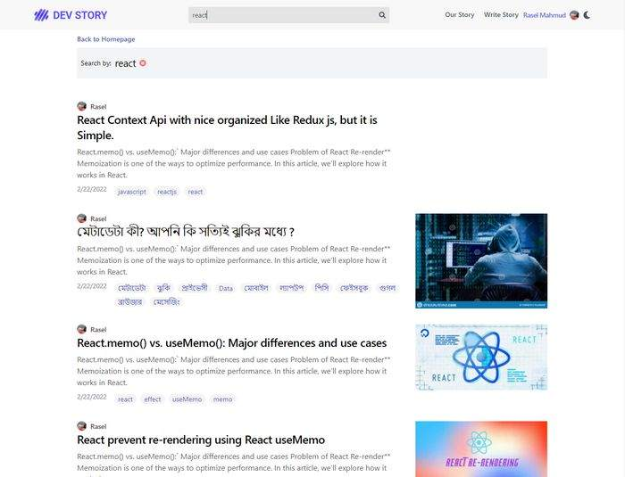
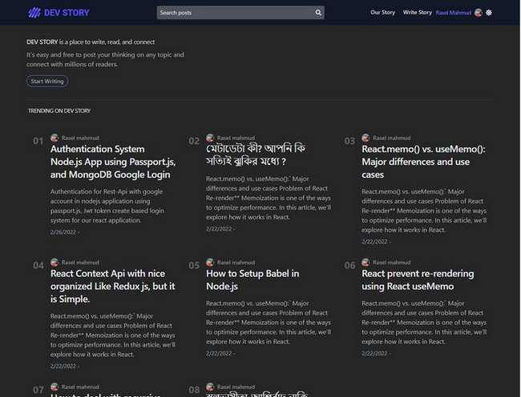
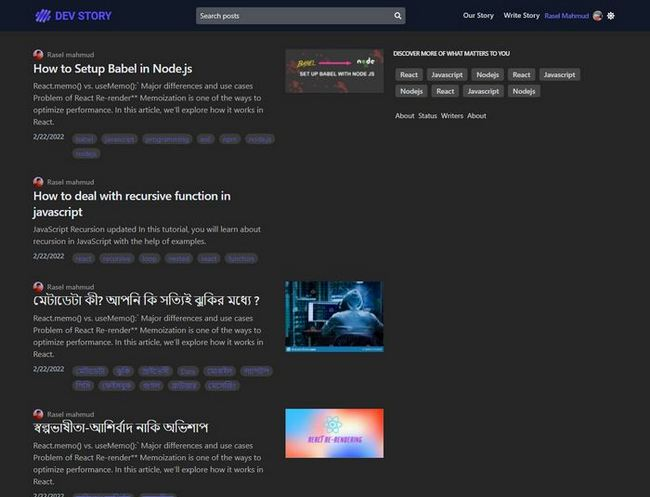

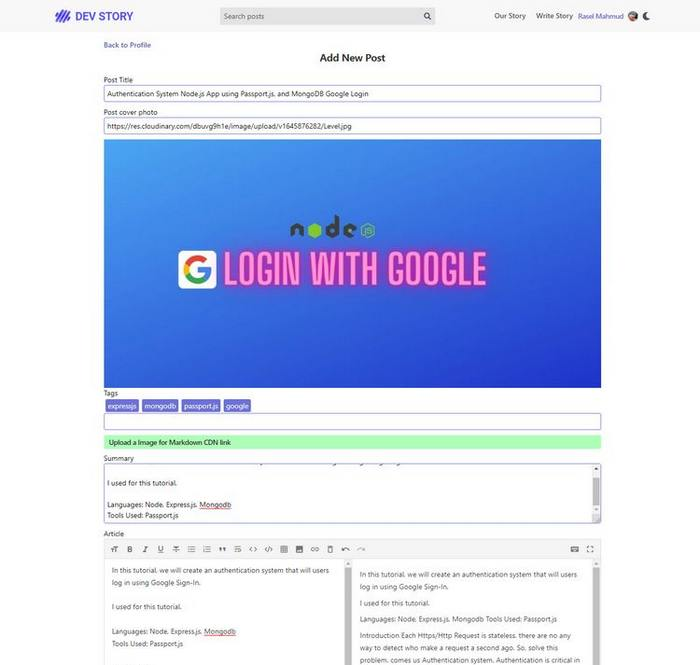
 

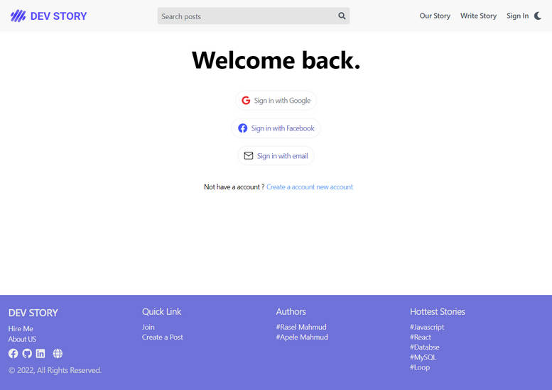
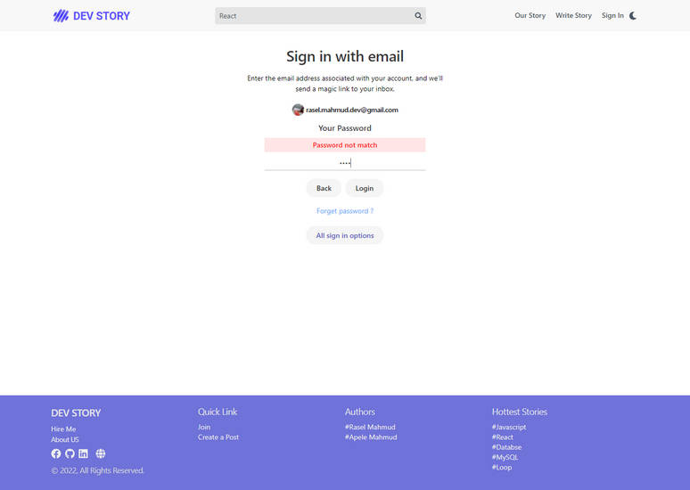
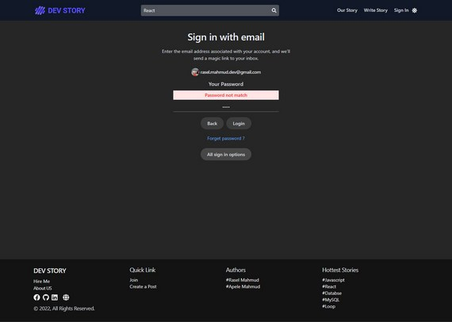
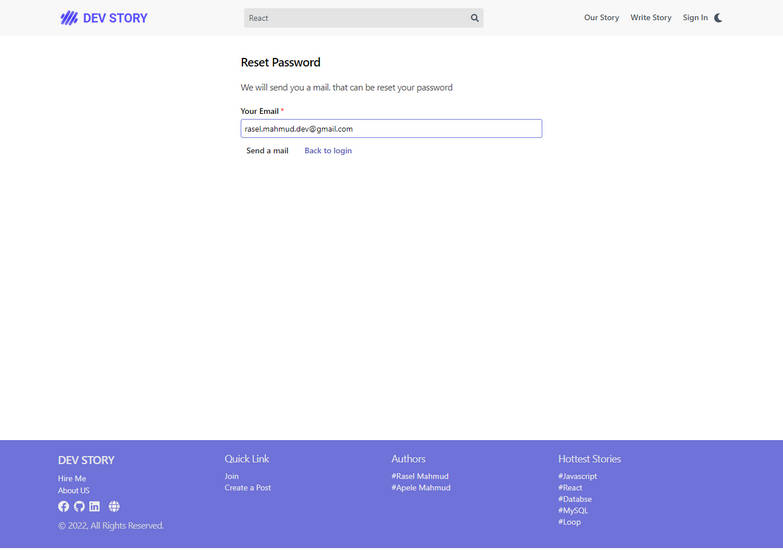
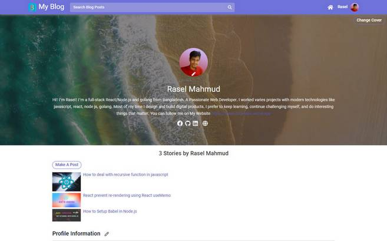

 
 

#### Post details Page
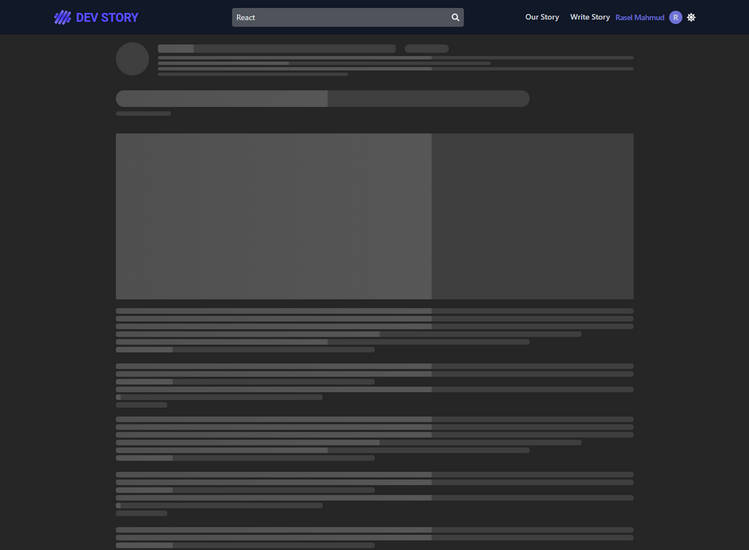
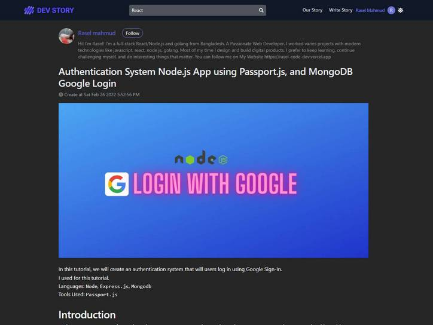
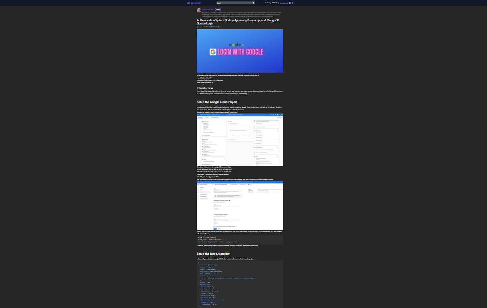
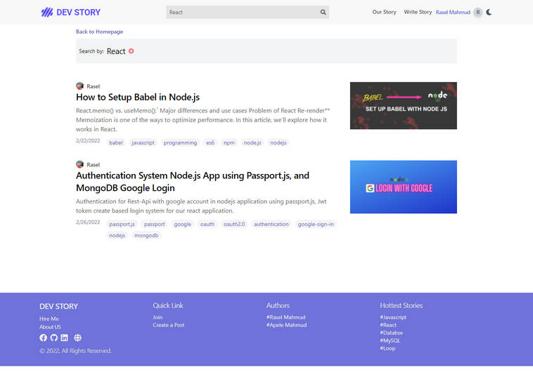
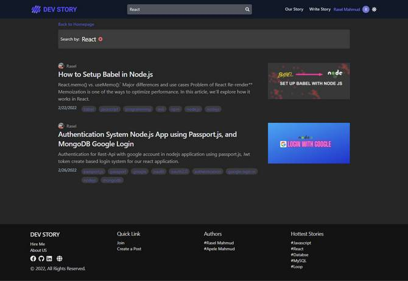

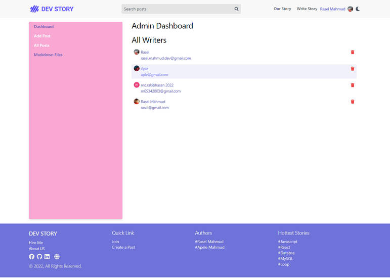
 
